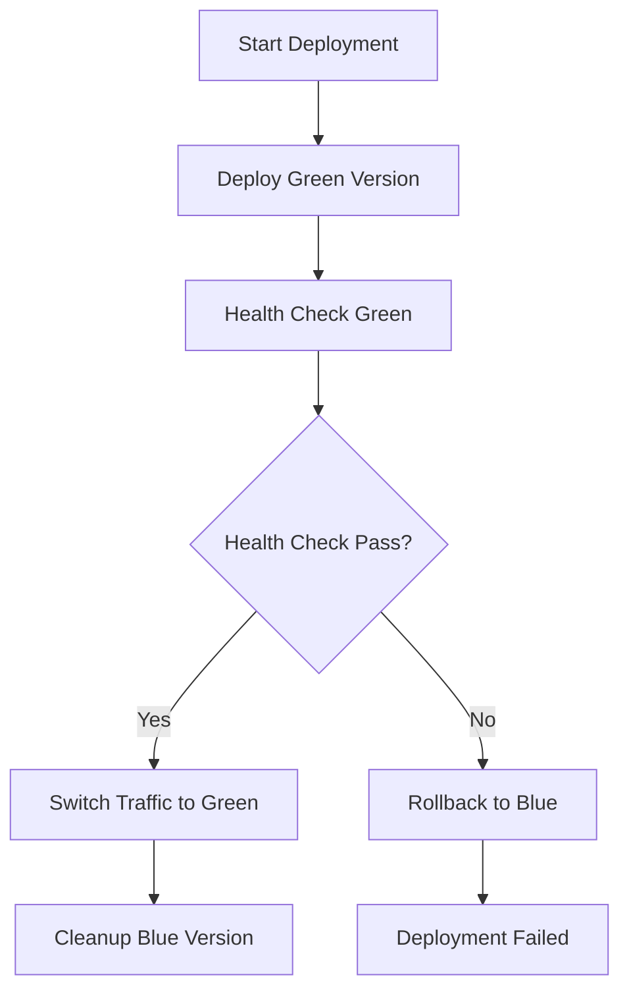

# 🚀 Deployment Guide - Blue-Green Strategy

## 📋 Prerequisites

### 1. AWS Setup
```bash
# Install AWS CLI
aws configure
# Enter your AWS credentials
```

### 2. GitHub Repository Setup
Configure these secrets in GitHub Settings → Secrets:
- `AWS_ACCESS_KEY_ID`
- `AWS_SECRET_ACCESS_KEY`

### 3. Container Images
Ensure your application images are available:
- `ghcr.io/arunprabus/health-api:dev`
- `ghcr.io/arunprabus/health-api:test`
- `ghcr.io/arunprabus/health-api:prod`
- `ghcr.io/arunprabus/frontend-config-app:dev`
- `ghcr.io/arunprabus/frontend-config-app:test`
- `ghcr.io/arunprabus/frontend-config-app:prod`

## 🎯 Deployment Process

### Step 1: Infrastructure Deployment
1. Go to **Actions** → **Infrastructure Deploy**
2. Select environment (dev/test/prod)
3. Click **Run workflow**

### Step 2: Application Deployment
1. Go to **Actions** → **Deploy to EKS**
2. Select environment
3. Click **Run workflow**

## 🔄 Blue-Green Deployment Flow



### What Happens During Deployment:

1. **Preparation**: Determines current active color (blue/green)
2. **Deploy New Version**: Creates new deployment with opposite color
3. **Health Validation**: Waits for pods to be ready
4. **Traffic Switch**: Updates service selectors instantly
5. **Cleanup**: Removes old version after 30s grace period
6. **Auto Rollback**: Reverts on any failure

## 🛠️ Manual Operations

### Check Current Status
```bash
# Get current active color
kubectl get service health-api-service -o jsonpath='{.spec.selector.color}'

# View all deployments
kubectl get deployments -l app=health-api

# Check service endpoints
kubectl get services
```

### Manual Rollback
```bash
# Switch back to blue
kubectl patch service health-api-service -p '{"spec":{"selector":{"color":"blue"}}}'
kubectl patch service frontend-service -p '{"spec":{"selector":{"color":"blue"}}}'

# Switch back to green
kubectl patch service health-api-service -p '{"spec":{"selector":{"color":"green"}}}'
kubectl patch service frontend-service -p '{"spec":{"selector":{"color":"green"}}}'
```

### Troubleshooting
```bash
# View deployment logs
kubectl logs -l app=health-api,color=green

# Describe failing pods
kubectl describe pods -l app=health-api,color=green

# Check events
kubectl get events --sort-by=.metadata.creationTimestamp
```

## 🔧 Configuration

### Environment Variables
Applications receive configuration via Kubernetes secrets:
- `DYNAMODB_PROFILES_TABLE`
- `DYNAMODB_UPLOADS_TABLE`
- `S3_BUCKET`
- `AWS_REGION`

### Health Checks
Both applications include:
- **Liveness Probe**: `/health` endpoint
- **Readiness Probe**: `/health` endpoint
- **Startup Delay**: 30s for liveness, 5s for readiness

## 📊 Monitoring

### Key Metrics to Watch
- Pod readiness status
- Service endpoint health
- Deployment rollout status
- Application response times

### Alerts Setup
Consider setting up alerts for:
- Failed deployments
- Pod crash loops
- Service unavailability
- High error rates

## 🚨 Emergency Procedures

### Immediate Rollback
If issues are detected post-deployment:
```bash
# Quick rollback via GitHub Actions
# Go to Actions → Deploy to EKS → Re-run previous successful deployment
```

### Complete Environment Reset
```bash
# Delete all deployments
kubectl delete deployments -l app=health-api
kubectl delete deployments -l app=frontend

# Redeploy from scratch
# Run GitHub Actions workflow again
```

## 🎓 Best Practices

1. **Always test in dev/test** before prod deployment
2. **Monitor application metrics** during deployment
3. **Keep rollback window short** (30s default)
4. **Use feature flags** for risky changes
5. **Maintain deployment logs** for troubleshooting

## 🔮 Advanced Strategies

### Canary Deployment
For even safer deployments, consider implementing canary releases:
- Deploy to 5% of traffic first
- Gradually increase to 25%, 50%, 100%
- Monitor metrics at each stage

### GitOps with ArgoCD
For fully automated deployments:
- ArgoCD monitors Git repository
- Automatic sync on configuration changes
- Drift detection and self-healing