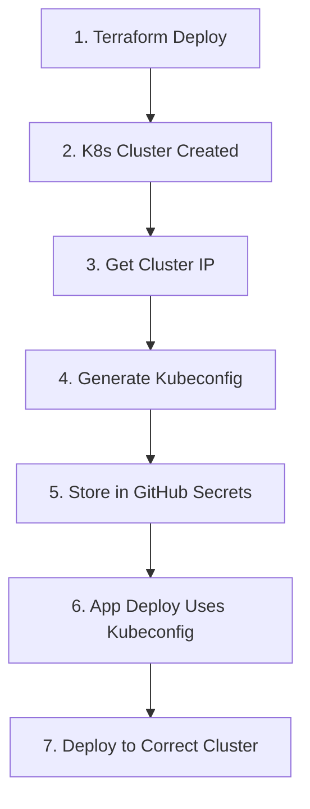

# 🚀 Complete Deployment Flow Guide

## 🔄 **How Application Knows About K8s Cluster**

### **Step-by-Step Flow:**



## 📋 **Detailed Process**

### **1. Infrastructure Deployment**
```bash
# Deploy infrastructure
Actions → Infrastructure → action: "deploy" → environment: "dev"

# Terraform creates:
- VPC and networking
- EC2 instance with K3s
- Security groups
- RDS database
```

### **2. Cluster Connection Setup**
```bash
# After infrastructure deployment:
1. Get EC2 public IP from Terraform output
2. Generate kubeconfig using setup-kubeconfig.sh
3. Base64 encode kubeconfig
4. Store as GitHub Secret: KUBECONFIG_DEV
```

### **3. Application Deployment**
```bash
# Deploy application
Actions → App Deploy → environment: "dev"

# Workflow uses:
1. KUBECONFIG_DEV secret (environment-specific)
2. Connects to https://CLUSTER_IP:6443
3. Deploys to health-app-dev namespace
```

## 🔧 **Configuration Mapping**

### **Environment-Specific Secrets**
```yaml
# GitHub Secrets Structure
KUBECONFIG_DEV: "Base64 encoded config for dev cluster"
KUBECONFIG_TEST: "Base64 encoded config for test cluster"  
KUBECONFIG_PROD: "Base64 encoded config for prod cluster"

# Fallback
KUBECONFIG: "Default kubeconfig if environment-specific not found"
```

### **Cluster Identification**
```yaml
# Each environment has unique:
Cluster Name: "health-app-{environment}"
Namespace: "health-app-{environment}"
Context: "health-app-{environment}"
Server: "https://{cluster-ip}:6443"
```

## 🎯 **Complete Setup Process**

### **First Time Setup (Per Environment)**

**Step 1: Deploy Infrastructure**
```bash
Actions → Infrastructure → action: "deploy" → environment: "dev"
```

**Step 2: Get Cluster Connection Info**
```bash
# From workflow output, get cluster IP
CLUSTER_IP="1.2.3.4"  # From Terraform output

# Generate kubeconfig locally
./scripts/setup-kubeconfig.sh dev $CLUSTER_IP
```

**Step 3: Update GitHub Secrets**
```bash
# Add environment-specific kubeconfig
Repository Settings → Secrets → Add:
Name: KUBECONFIG_DEV
Value: [Base64 encoded kubeconfig from script output]
```

**Step 4: Deploy Application**
```bash
Actions → App Deploy → environment: "dev"
```

### **Subsequent Deployments**
```bash
# Just deploy application (kubeconfig already configured)
Actions → App Deploy → environment: "dev"
```

## 🔍 **How App Deploy Workflow Works**

### **Environment Detection**
```yaml
# Workflow determines environment from:
1. Manual input (workflow_dispatch)
2. Git branch (develop → dev, main → prod)
3. Defaults to dev
```

### **Cluster Connection**
```yaml
# Workflow connects using:
1. Environment-specific secret: KUBECONFIG_{ENVIRONMENT}
2. Fallback to default: KUBECONFIG
3. Verifies connection: kubectl cluster-info
```

### **Application Deployment**
```yaml
# Deploys to correct namespace:
Namespace: health-app-{environment}
Deployment: health-api-backend-{environment}
Service: health-api-service-{environment}
```

## 🛠️ **Manual Verification**

### **Check Cluster Connection**
```bash
# SSH to cluster
ssh -i ~/.ssh/aws-key ubuntu@CLUSTER_IP

# Check K3s status
sudo k3s kubectl get nodes
sudo k3s kubectl get namespaces
sudo k3s kubectl get pods -A
```

### **Verify Application Deployment**
```bash
# Using local kubectl (with proper kubeconfig)
kubectl get namespaces
kubectl get pods -n health-app-dev
kubectl get services -n health-app-dev
kubectl logs -l app=health-api -n health-app-dev
```

## 🚨 **Troubleshooting**

### **Common Issues**

**1. Kubeconfig Not Found**
```bash
Error: Secret KUBECONFIG_DEV not found
Solution: Generate and add kubeconfig to GitHub Secrets
```

**2. Cluster Connection Failed**
```bash
Error: Unable to connect to server
Solution: 
- Check EC2 instance is running
- Verify security group allows port 6443
- Confirm K3s is running on cluster
```

**3. Wrong Namespace**
```bash
Error: Namespace health-app-dev not found
Solution: Create namespace or deploy K8s manifests first
```

### **Debug Commands**
```bash
# Check cluster info
kubectl cluster-info

# List all contexts
kubectl config get-contexts

# Check current context
kubectl config current-context

# Test connection
kubectl get nodes -v=6
```

## 📊 **Environment Isolation**

### **Complete Separation**
```yaml
Dev Environment:
  - Cluster: health-app-dev (separate EC2)
  - Namespace: health-app-dev
  - Database: health-app-db-dev
  - Secrets: KUBECONFIG_DEV

Test Environment:
  - Cluster: health-app-test (separate EC2)
  - Namespace: health-app-test  
  - Database: health-app-db-test
  - Secrets: KUBECONFIG_TEST

Prod Environment:
  - Cluster: health-app-prod (separate EC2)
  - Namespace: health-app-prod
  - Database: health-app-db-prod
  - Secrets: KUBECONFIG_PROD
```

This ensures **complete isolation** between environments and **automatic cluster detection** based on the deployment environment! 🎉